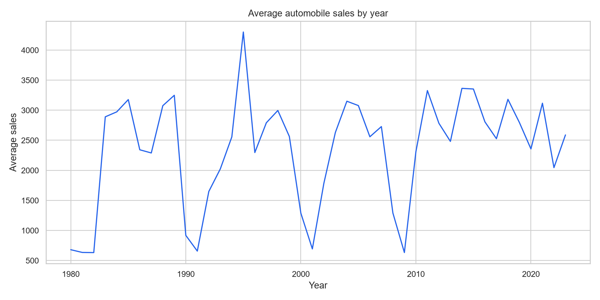
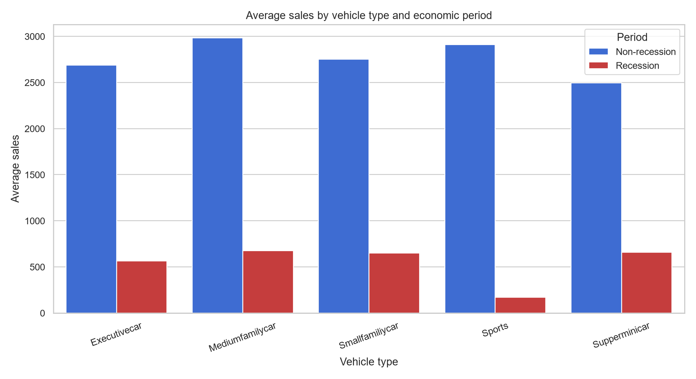

# Automobile Sales Analysis Dashboard

How do automobile sales vary across years, vehicle categories, and recession periods?

This project analyzes 528 monthly observations from the fictional XYZAutomotives scenario used in the IBM Data Visualization course. It combines a reproducible analytical pipeline, an exploratory notebook, and an interactive Plotly Dash application.

## Objective

- compare automobile sales during recession and non-recession periods;
- explore trends by year, month, and vehicle category;
- examine advertising expenditure and unemployment alongside sales;
- provide both reproducible portfolio charts and an interactive dashboard;
- preserve the original IBM course notebook as a learning artifact.

## Dataset

The dataset contains monthly records from 1980 through 2023. Its fields include automobile sales, vehicle type, average price, advertising expenditure, GDP, consumer confidence, unemployment, competition, seasonality, and recession indicators.

The scripts download the IBM Skills Network course dataset automatically and cache it in `data/`, which is excluded from version control. XYZAutomotives is a fictional scenario, so the findings must not be interpreted as the performance of a real company.

## Main insights

- Average monthly sales are `648.52` during records marked as recessions, compared with `2,816.75` outside them: a descriptive difference of `-76.98%`.
- `Mediumfamilycar` has the highest average sales among vehicle categories during recession records; the effect still differs substantially by segment.
- Within recession records, unemployment and automobile sales have a weak negative correlation (`-0.2486`). This association does not establish causality.
- The highest annual average occurs in 1995 and the lowest in 1982 within this fictional course scenario.
- Advertising charts aggregate expenditure, while sales charts use averages; keeping these aggregations explicit prevents misleading comparisons.





Exact reproducible values are generated in `reports/analysis_summary.csv` by running `src/main.py`.

## Interactive dashboard

The dashboard provides two report modes:

- **Yearly Statistics:** annual trend, monthly sales for a selected year, sales by vehicle type, and advertising expenditure by category.
- **Recession Period Statistics:** recession-year trend, sales by vehicle type, advertising shares, and sales by unemployment rate.

The year selector is enabled only for the yearly report. The annual overview intentionally shows the complete period; the other yearly charts follow the selected year.

## Repository structure

```text
automobile-sales-dashboard/
├── dashboard/
│   ├── assets/style.css
│   └── app.py
├── data/                            # downloaded dataset (not tracked)
├── images/                          # generated portfolio charts
├── notebooks/
│   └── automobile_sales_analysis.ipynb
├── reports/                         # generated analytical summary
├── src/
│   └── main.py
├── tests/
│   └── test_analysis.py
├── .gitignore
├── LICENSE
├── README.md
└── requirements.txt
```

## How to run

From the repository root in PowerShell:

```powershell
python -m venv .venv
.\.venv\Scripts\Activate.ps1
python -m pip install -r requirements.txt
python src/main.py
python dashboard/app.py
```

Open http://127.0.0.1:8050 to use the dashboard. Stop it with `Ctrl+C`.

Run the automated checks with:

```powershell
python -m unittest discover -s tests -v
```

## Study notebook

The notebook in `notebooks/` retains the original IBM course exercises and their outputs. It has not been rewritten to manufacture new results; the standalone pipeline is the reproducible source for the portfolio summary and charts.

## Technologies

Python · Pandas · Plotly · Dash · Matplotlib · Seaborn · Jupyter

## Academic attribution

The notebook and dataset originate from IBM Skills Network course material and retain their educational context. The standalone analysis, dashboard corrections, tests, and portfolio documentation are the repository's original additions.

## License

The repository uses the [MIT License](LICENSE) for original code and contributions. IBM course content and third-party data remain subject to their respective terms.
